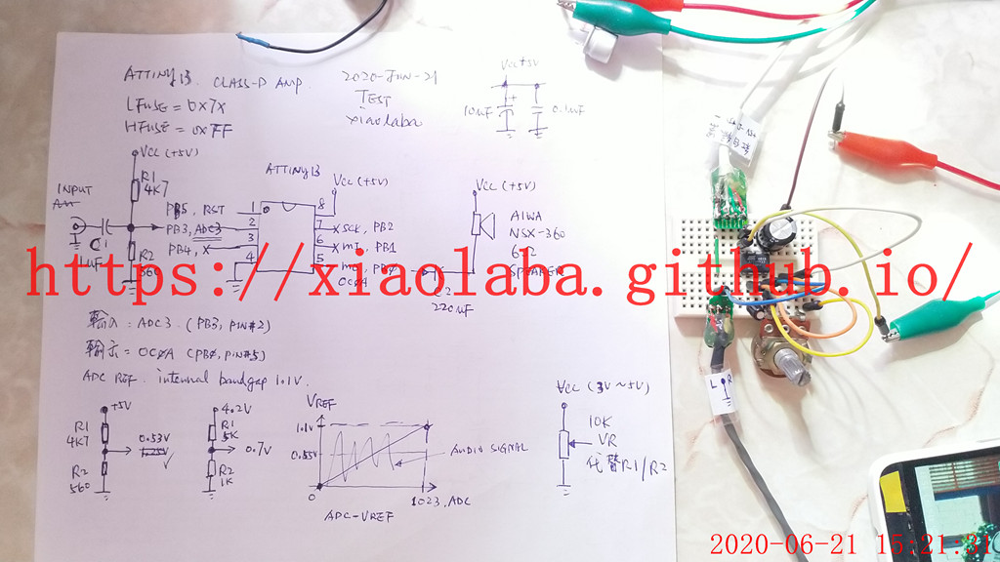

# Tiny13_D-AMP
clone https://github.com/lpodkalicki/blog/tree/master/avr/attiny13/052_8bit_mono_class_d_amplifier  
  
### build to test  
.  
circuit,

test, 5K/1K, no good  
https://youtu.be/Gl5eU9fMuMM  

.  

test, 10K VR, ok  
https://youtu.be/lBp4UAOIjj0 

.  
.
### uses batch file to build hex for flash buring
build.bat, build C source code to burn image.  
burn.bat, it is saying as it is.  
terminal, connect to chip for command mode.  
